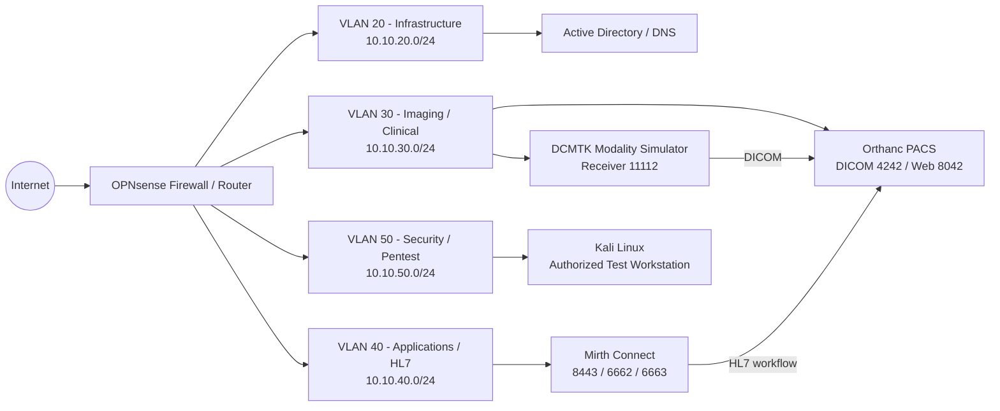

# DICOM/PACS Security Homelab

An isolated, segmented healthcare-imaging cybersecurity homelab used to validate DICOM/PACS security controls, document attack paths, preserve evidence, and practice remediation and retesting.

> **Status:** Initial penetration-testing phase complete. **35 structured tests (TEST-001 through TEST-035)** were executed. Remediation and retesting are the next phase.

## Purpose

This project combines healthcare imaging knowledge with defensive and offensive security testing. The lab models a simplified clinical imaging environment with separate infrastructure, imaging/clinical, HL7/application, and security-testing segments.

The assessment focused on:

- Orthanc PACS REST/API authentication and authorization
- DICOM C-ECHO, C-FIND, C-GET, C-MOVE, and C-STORE behavior
- AE Title trust and spoofing resistance
- Management-plane and DICOM transport encryption
- DCMTK host security, SSH, patching, logging, permissions, and storage controls
- Mirth Connect management and HL7 network paths
- Active Directory password and lockout controls
- Proxmox management, backup, and storage controls
- Inter-VLAN segmentation and egress policy
- Time synchronization, auditability, and evidence integrity

## Assessment Snapshot

The complete assessment identified **18 consolidated findings**. Repeated tests that demonstrated the same root cause were intentionally consolidated rather than counted as separate vulnerabilities.

| Severity | Open Findings | Primary Themes |
|---|---:|---|
| High | 7 | Orthanc REST/API exposure, plaintext transport, unauthorized C-STORE, AE Title spoofing |
| Medium | 6 + 1 remediated | Host hardening, encryption at rest, backup/recovery, password policy, audit visibility, time sync |
| Low | 4 | Patch availability, host firewall, Mirth certificate hygiene, Proxmox privileged-auth hardening |

See [`docs/findings.md`](docs/findings.md) for the consolidated finding list and [`docs/test-matrix.md`](docs/test-matrix.md) for all 35 tests.

## Architecture

The public repository intentionally omits exact endpoint addresses. VLAN subnet ranges are retained to show segmentation design.



More detail: [`docs/architecture.md`](docs/architecture.md)

## Repository Structure

```text
dicom-pacs-security-homelab/
├── README.md
├── LICENSE
├── SECURITY.md
├── .gitignore
├── docs/
│   ├── architecture.md
│   ├── scope.md
│   ├── methodology.md
│   ├── findings.md
│   ├── test-matrix.md
│   ├── remediation-roadmap.md
│   └── evidence-guide.md
├── reports/
│   └── DICOM_PACS_Pentest_Report_PUBLIC_SANITIZED.pdf
├── scripts/
│   ├── dicom_modifier.py
│   └── orthanc_log_monitor.py
├── evidence/
│   ├── raw/              # intentionally excluded from Git
│   └── sanitized/
└── assets/
```

## Key Security Outcomes

### Findings requiring remediation

- Orthanc REST/API access was not adequately authenticated.
- Orthanc management traffic used plaintext HTTP.
- DICOM transport was not protected with TLS.
- An unregistered AE could perform C-STORE.
- A registered AE Title could be spoofed from another source when network reachability was intentionally granted for testing.
- Encryption-at-rest and backup/recovery controls need improvement.
- Password/lockout and end-to-end audit controls need additional hardening.

### Controls that worked

- Incorrect called AE Titles were rejected.
- Rogue C-FIND, C-GET, and C-MOVE operations were denied while authorized operations succeeded.
- Inter-VLAN segmentation blocked protected services from the Pentest VLAN after temporary testing rules were removed.
- DICOM malformed-association testing did not destabilize the service.
- Final evidence manifests verified with SHA-256.
- Time synchronization was remediated during the engagement using the approved internal NTP source.

## Public Report

A sanitized portfolio copy of the final report is available here:

[`reports/DICOM_PACS_Pentest_Report_PUBLIC_SANITIZED.pdf`](reports/DICOM_PACS_Pentest_Report_PUBLIC_SANITIZED.pdf)

Exact endpoint IP addresses and selected infrastructure identifiers were removed from the public report. Raw packet captures and original evidence are **not** published.

## Remediation Phase

The next phase will address the highest-risk findings first, then rerun the relevant tests to produce a separate remediation/retest record. The original evidence and initial assessment report remain immutable as the baseline.

Priority order:

1. Enable Orthanc authentication and restrict management access.
2. Enable HTTPS for management traffic and DICOM TLS where supported.
3. Disable permissive C-STORE behavior and strengthen modality trust beyond AE Title alone.
4. Harden DCMTK SSH, host firewall, and account policy.
5. Improve encryption at rest and backup/recovery validation.
6. Improve audit visibility and retention.
7. Close remaining patch, certificate, and privileged-authentication hygiene gaps.

## Safety / Ethics

This repository documents testing performed only against systems owned and controlled in an isolated homelab. Synthetic DICOM data was used for controlled write-path testing. No production healthcare systems, real patient data, or third-party networks were targeted.

Do not use the material in this repository against systems without explicit authorization.

## License

Code and documentation are provided under the MIT License unless otherwise noted.
