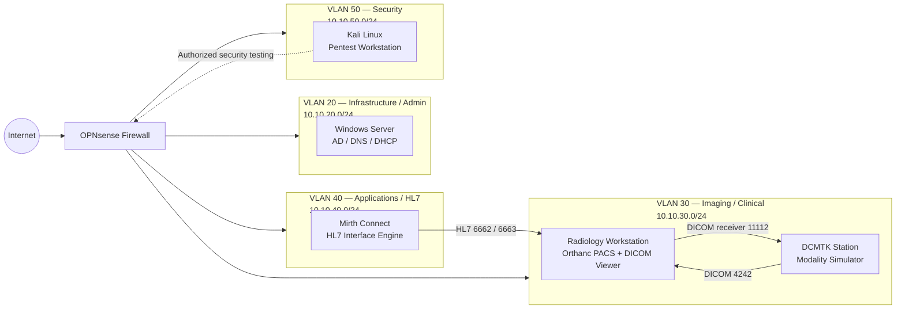

# DICOM/PACS Security Homelab

> A segmented healthcare-imaging cybersecurity lab used to validate DICOM/HL7 workflows and perform authorized penetration testing against simulated clinical systems.

## Project Status

**Security assessment: In progress**

The lab is functional and the baseline DICOM/HL7 workflows have been validated. Penetration testing is being documented incrementally so that this repository distinguishes between:

- **Validated functionality** — the clinical workflow works as designed.
- **Completed security tests** — a test was executed and evidence was captured.
- **Observed security controls** — a defensive behavior was observed but still needs deeper bypass testing.
- **Planned tests** — a scenario is in the test plan but is not yet reported as a finding.

This prevents unverified test ideas from being presented as vulnerabilities.

---

## Why I Built This

Medical imaging environments combine specialized protocols, legacy assumptions, Windows infrastructure, PACS applications, interface engines, and network segmentation. This homelab gives me a controlled environment to practice securing and testing those workflows without interacting with production healthcare systems.

The project focuses on:

- DICOM/PACS security testing
- Healthcare network segmentation
- DICOM service enumeration
- AE Title trust and authorization behavior
- PACS web/API security
- DICOM metadata manipulation
- Traffic inspection
- HL7 interface security
- Detection and logging
- Evidence collection and professional reporting

---

## Lab Architecture



### Key Services

| Component | Purpose | Publicly Documented Ports |
|---|---|---:|
| Orthanc PACS | DICOM storage/query/retrieve | TCP 4242 |
| Orthanc Web/API | PACS management/API | TCP 8042 |
| DCMTK receiver | DICOM Store SCP / retrieve testing | TCP 11112 |
| Mirth Connect | Administration | TCP 8443 |
| Mirth Connect | HL7 test listener | TCP 6662 |
| Mirth Connect | HL7-to-Orthanc workflow | TCP 6663 |

Exact host addresses and credentials are intentionally omitted from the public repository.

---

## Baseline Workflow Validation

The following functionality was validated before security testing began:

| Workflow | Status |
|---|---|
| DICOM C-ECHO | ✅ Validated |
| DICOM C-STORE | ✅ Validated |
| DICOM C-FIND | ✅ Validated |
| DICOM C-MOVE / C-GET | ✅ Validated |
| DCMTK modality simulation | ✅ Validated |
| Orthanc PACS operation | ✅ Validated |
| HL7 ADT workflow | ✅ Validated |
| HL7 ORM workflow | ✅ Validated |
| HL7 ORU workflow | ✅ Validated |
| Mirth channel processing | ✅ Validated |
| Inter-VLAN firewall policy validation | ✅ Baseline validated |

---

## Penetration Testing Areas

### 1. Network & Service Enumeration
- Identify reachable hosts and exposed services from the security VLAN.
- Compare observed exposure with intended OPNsense policy.
- Save scan output for repeatability and evidence.

### 2. DICOM Association & AE Title Testing
- Verify how PACS and DICOM endpoints handle known and unknown modalities.
- Test whether AE Title restrictions function as an actual authorization control.
- Document rejection/acceptance behavior and any spoofing opportunities.

### 3. Orthanc Web/API Testing
- Enumerate the HTTP attack surface on TCP 8042.
- Review authentication, authorization, exposed API functions, and configuration.
- Test only against the isolated lab PACS.

### 4. DICOM Metadata Integrity
- Modify non-production DICOM metadata using `pydicom`.
- Send controlled test files through the workflow.
- Observe whether altered metadata is accepted, logged, or rejected.

### 5. Traffic Inspection
- Capture authorized lab DICOM/HL7 traffic.
- Determine whether sensitive metadata is visible in transit.
- Store only sanitized screenshots or excerpts in this public repository.

### 6. Detection & Monitoring
- Review Orthanc logs for failed associations, suspicious queries, retrieval failures, and abnormal stores.
- Build simple detection scripts to turn lab activity into defensive observations.

---

## Current Security Assessment Progress

| Test Area | State | Public Evidence |
|---|---|---|
| Lab workflow baseline | Complete | Documentation |
| VLAN/firewall validation | Complete baseline | Sanitized evidence to be added |
| Clinical VLAN/service enumeration | In progress | Scan excerpts to be added |
| DCMTK Station enumeration | In progress | Scan excerpts to be added |
| Known/unknown AE Title behavior | Observed | Sanitized evidence to be added |
| Orthanc REST/API assessment | In progress | Evidence to be added |
| DICOM metadata tampering | Script prepared | Test evidence pending |
| DICOM traffic confidentiality | Planned/ongoing | PCAP excerpt pending |
| Orthanc log detection | Script prepared | Test evidence pending |
| HL7 security testing | Planned | — |
| Privilege escalation/lateral movement | Future phase | — |

---

## Repository Layout

```text
dicom-pacs-security-homelab/
├── README.md
├── LICENSE
├── SECURITY.md
├── .gitignore
├── docs/
│   ├── architecture.md
│   ├── scope.md
│   ├── methodology.md
│   ├── test-matrix.md
│   ├── findings.md
│   ├── evidence-guide.md
│   └── github-upload-steps.md
├── scripts/
│   ├── dicom_modifier.py
│   └── orthanc_log_monitor.py
├── evidence/
│   ├── README.md
│   ├── raw/          # ignored by Git
│   └── sanitized/    # safe screenshots/excerpts only
└── assets/
```

---

## Tools Used

- Kali Linux
- Nmap
- Wireshark / tcpdump
- DCMTK
- Orthanc
- Mirth Connect
- OPNsense
- `curl`
- `pydicom`
- Python
- Windows Server / Active Directory
- Proxmox VE

---

## Example DICOM Commands

> Example commands use documentation placeholders rather than live endpoint addresses.

```bash
# Verify DICOM connectivity
echoscu -aec ORTHANC <PACS_IP> 4242

# Query at study level
findscu -aec ORTHANC -S \
  -k 0008,0052=STUDY \
  <PACS_IP> 4242

# Send a lab DICOM object
storescu -aec ORTHANC <PACS_IP> 4242 test-image.dcm

# Start a DCMTK receiver
storescp 11112 -od ./received
```

---

## Findings Philosophy

A GitHub portfolio should show **evidence and reasoning**, not just attack commands.

Each confirmed finding will contain:

1. Title
2. Affected component
3. Risk
4. Description
5. Reproduction summary
6. Evidence
7. Impact
8. Remediation
9. Retest status

See [`docs/findings.md`](docs/findings.md).

---

## Safety & Ethics

This project is performed exclusively in an isolated homelab that I own and control. It is intended for cybersecurity education, healthcare security research, defensive validation, and professional development.

No production healthcare system, real patient data, or third-party infrastructure is targeted.

---

## Public Repository Data Handling

This repository intentionally excludes:

- Credentials and secrets
- Exact endpoint IP addresses
- Real patient information
- Raw DICOM datasets containing identifying information
- Raw packet captures
- Unredacted logs
- Private keys
- Tokens
- Internal configuration backups

Only synthetic or sanitized evidence should be committed.

---

## Roadmap

- [x] Build segmented DICOM/HL7 homelab
- [x] Validate DICOM workflows
- [x] Validate HL7 workflows
- [x] Establish pentest evidence structure
- [ ] Complete DCMTK Station assessment
- [ ] Complete Orthanc DICOM security assessment
- [ ] Complete Orthanc Web/API assessment
- [ ] Capture and document DICOM transport security test
- [ ] Test DICOM metadata integrity controls
- [ ] Expand Orthanc monitoring detections
- [ ] Perform HL7 interface security assessment
- [ ] Publish finalized findings and remediation
- [ ] Produce final penetration test report

---

## Disclaimer

For educational and authorized security-testing purposes only.
