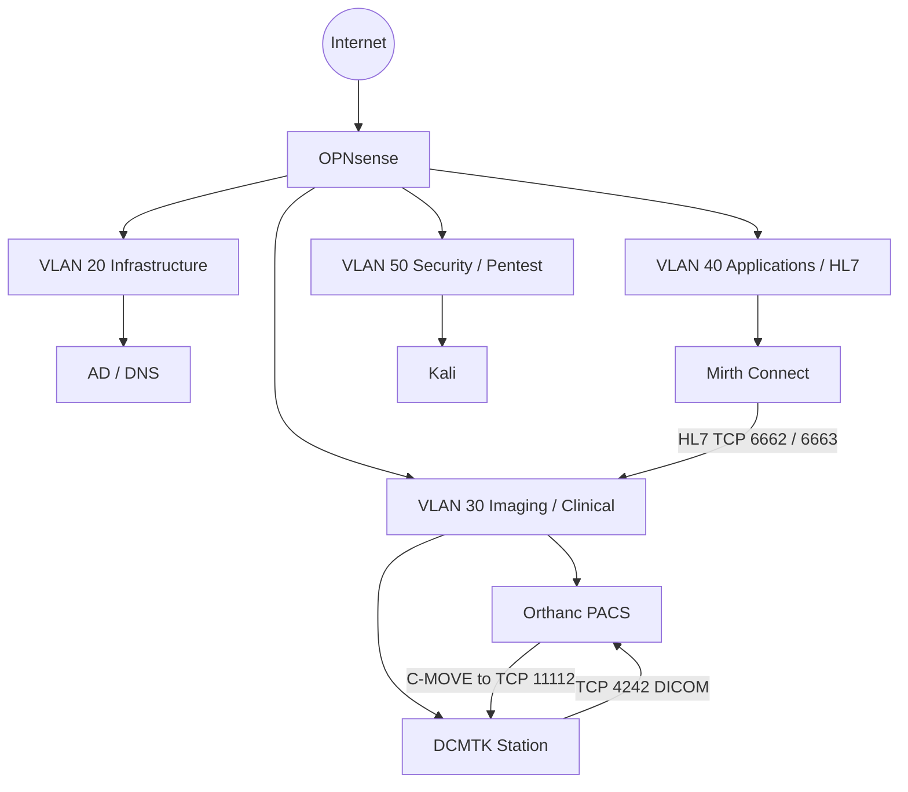

# Architecture

## Segmentation Model

The public documentation retains subnet-level segmentation while intentionally omitting exact endpoint addresses.

| VLAN | Subnet | Function | Representative Assets |
|---|---|---|---|
| 20 | `10.10.20.0/24` | Infrastructure | Active Directory, DNS |
| 30 | `10.10.30.0/24` | Imaging / Clinical | Orthanc PACS, Radiology Workstation, DCMTK Station |
| 40 | `10.10.40.0/24` | Applications / HL7 | Mirth Connect |
| 50 | `10.10.50.0/24` | Security / Pentest | Kali Linux |

## Logical Topology

## Design Intent

- Pentest VLAN should not directly reach protected internal services under normal policy.
- DCMTK should reach approved Orthanc DICOM services but not unrestricted management or Internet services.
- Only required HL7 application paths should be permitted between clinical and application segments.
- DICOM authorization should distinguish approved modalities from rogue identities.

Exact endpoint addresses are retained only in the private lab documentation and original evidence package.
